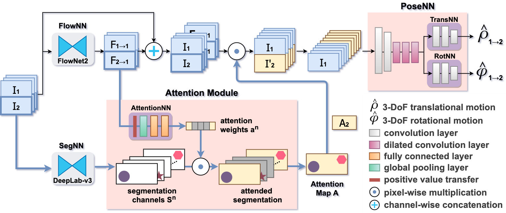

# Dynamic Attention-based Visual Odometry

    



**Dynamic attention-based visual odometry framework** (DAVO) is a learning-based VO method, for estimating the ego-motion of a monocular camera. DAVO dynamically adjusts the attention weights on different semantic categories for different motion scenarios based on optical flow maps. These weighted semantic categories can then be used to generate attention maps that highlight the relative importance of different semantic regions in input frames for pose estimation. In order to examine the proposed DAVO, we perform a number of experiments on the KITTI Visual Odometry and SLAM benchmark suite to quantitatively and qualitatively inspect the impacts of the dynamically adjusted weights on the accuracy of the evaluated trajectories. Moreover, we design a set of ablation analyses to justify each of our design choices, and validate the effectiveness as well as the advantages of DAVO. Our experiments on the KITTI dataset shows that the proposed DAVO framework does provide satisfactory performance in ego-motion estimation, and is able deliver competitive performance when compared to the contemporary VO methods.

## Environment
This codebase is tested on Ubuntu 16.04 with Tensorflow 1.13.1 and CUDA 10.0 (w/ cuDNN 7.5).

## Installation

#### 1. Clone this repository.

```bash
git clone https://github.com/BassyKuo/DAVO.git
```

#### 2. Check the python version

Make sure the python version you used is python3.6.

```bash
python -V                           # should be python 3.6
```

#### 3. Requirements

Install necessary packages from the requirement file.

```bash
pip install -r requirements.txt
```

#### (optional) 4. Use customized cuda path

If you do not have CUDA 10.0, please download CUDA 10.0 toolkit from the official website or [here](https://developer.nvidia.com/cuda-10.0-download-archive), and set the path where you installed to `$CUDA_HOME`.

```bash
export CUDA_HOME="<your_cuda_path>"
export LD_LIBRARY_PATH="$CUDA_HOME/lib64:$LD_LIBRARY_PATH"
```

## Quickstart

Use following scripts to quickly start while you have already setup the environment and the dataset.

#### Training
```bash
version="v1-decay100k-sharedNN-dilatedPoseNN-cnv6_128-segmask_all-se_flow-abs_flow-fc_tanh"

# Train the model w/ flipping images.
./run_training.sh ${version}

# Train the model w/ augmented images (including flipping, brightness, contrast, saturation, hue).
./run_training.sh ${version} --data_aug
```

###### :arrow_right: Check [here](./doc/arch-variants.md) to see more available `${version}` names.

#### Inference
```bash
export ckpt_dir="ckpt_dir/v1-decay100k-sharedNN-dilatedPoseNN-cnv6_128-segmask_all-se_flow-abs_flow-fc_tanh/"
export version="v1-decay100k-sharedNN-dilatedPoseNN-cnv6_128-segmask_all-se_flow-abs_flow-fc_tanh"
export seq_name="03"
export ckpt_step="1500000"
export output_root="test_DAVO"

# Run the script to generate predicted poses of sequence ${seq_name}.
./run_estimation.sh ${ckpt_dir} ${version} ${seq_name} ${ckpt_step} ${output_root}

# The result would be saved in ${output_root}/${version}--model-${ckpt_step}
```

###### :arrow_right: Download the pretrained model from our [google drive](https://drive.google.com/drive/folders/1FMx7h4ngN4T2ee1XF-64G5vdmr1BOGfi?usp=sharing) and set "pretrain-ckpt" to $ckpt_dir for quickly.

#### Evaluation
```bash
cd kitti_benchmark/

export test_output_dir="../${output_root}/${version}--model-${ckpt_step}"
export save_name="${version}--model-${ckpt_step}"

# Use pose_kitti_eval.sh to run the KITTI Benchmark.
./pose_kitti_eval.sh ${test_output_dir} ${save_name}
```

###### :arrow_right: Check [here](./kitti_benchmark/README.md) to see more information.

---

## Prepare Training/Testing Data

There are three types of inputs used in DAVO:

1. [RGB frames](./doc/preprocessing.md#rgb-frames)
2. [Optical flows](./doc/preprocessing.md#optical-flows)
3. [Semantic segmentations](./doc/preprocessing.md#semantic-segmentations)

Please check [here](doc/preprocessing.md) to see how to prepare them for DAVO.


## Training
Once the data are formatted following the above instructions, you are able to train the model with the following command:

```bash
python train.py \
    --dataset_dir=$kitti_odom_dump \
    --img_width=416 \
    --img_height=128 \
    --batch_size=4 \
    --seq_length=3 \
    --max_steps=310000 \
    --save_freq=25000 \
    --learning_rate=0.001 \
    --pose_weight=0.1 \
    --checkpoint_dir=./ckpt/${version} \
    --version=${version}
```

#### Example:

```bash
python train.py \
    --dataset_dir=./kitti_odom-dump/ --img_width=416 --img_height=128 --batch_size=4 \
    --seq_length=3 --max_steps=310000 --save_freq=25000 --learning_rate=0.001  --pose_weight=0.1 \
    --checkpoint_dir=./ckpt/v1-decay100k-sharedNN-dilatedPoseNN-cnv6_128-segmask_all-se_flow-abs_flow-fc_tanh \
    --version=v1-decay100k-sharedNN-dilatedPoseNN-cnv6_128-segmask_all-se_flow-abs_flow-fc_tanh
```

Note that all available `${version}` names are defined [here](./doc/arch-variants.md).


## Evaluation
To evaluate the pose estimation performance in this work, use the following command to produce esitimated poses first:

```bash
python test_kitti_pose.py \
    --test_seq=$seq \
    --concat_img_dir=./kitti_odom-dump/ \
    --ckpt_file=${ckpt_file} \
    --version=${version} \
    --output_dir=${output_dir}
```

#### Example:
```bash
export VESION="v1-decay100k-sharedNN-dilatedPoseNN-cnv6_128-segmask_all-se_flow-abs_flow-fc_tanh"
export MODEL_NAME="$VERSION"

python test_kitti_pose.py \
    --test_seq=3 \
    --concat_img_dir=./kitti_odom-dump/ \
    --ckpt_file=./ckpt/v1-decay100k-sharedNN-dilatedPoseNN-cnv6_128-segmask_all-se_flow-abs_flow-fc_tanh/model-10 \
    --version=$VERSION
    --output_dir=./test_DAVO/$SAVE_NAME
```

Then copy the prediction file to the `kitti_benchmark/results/$MDOEL_NAME/data/` folder and execute `./test_odometry_all $MODEL_NAME`. Please check [here](./kitti_benchmark/README.md) to see how to do that, or use the quickscript:

```bash
cd kitti_benchmark/
./pose_kitti_eval.sh ../test_DAVO/$SAVE_NAME $SAVE_NAME
```

###### :arrow_right: Check [here](./doc/results.md) to see the evaluation results.

## Visualization

In our work, we use [evo](https://github.com/MichaelGrupp/evo) tool to visualize trajetories with references sequences 00 to 10:

```bash
for seq in {00..10..1} ; do 
    evo_traj kitti \
        --ref kitti_benchmark/data/odometry/poses/${seq}.txt \
        ./test_DAVO/v1-decay100k-sharedNN-dilatedPoseNN-cnv6_128-segmask_all-se_flow-abs_flow-fc_tanh--model-10/${seq}-pred_kitti_pose.txt \
        -p --plot_mode xz --save_plot plots/${figure_name}.png
done
```

Because of the lack of ground truth poses in the testing sequence 11 to 21, we use trajetories generated from ORB-SLAM2-S ([ORB-SLAM2](https://github.com/raulmur/ORB_SLAM2) stereo version) to compare our prediction:
```bash
for seq in {11..21..1} ; do 
    evo_traj kitti \
        --ref kitti_benchmark/data/odometry/poses_from_ORBSLAM2-S/${seq}-ORB-SLAM2-S.txt \
        ./test_DAVO/v1-decay100k-sharedNN-dilatedPoseNN-cnv6_128-segmask_all-se_flow-abs_flow-fc_tanh--model-10/${seq}-pred_kitti_pose.txt \
        -p --plot_mode xz --save_plot plots/${figure_name}.png
done
```

#### [NOTE]

Before you use the `--save_plot` argument to save in png file, please change the export format first:

```
evo_config set plot_export_format png
```

you could also change trajetory colors:

```
evo_config set plot_seaborn_palette Dark2
```

###### :arrow_right: Execute `evo_config show` to see more configurations.


# Contact
Please feel free to contact us if you have any questions. :smile:

# Acknowledgements
We appreciate the great works/repos along this direction, such as [SfMLearner](https://github.com/tinghuiz/SfMLearner), [GeoNet](https://github.com/yzcjtr/GeoNet), [DeepMatchVO](https://github.com/hlzz/DeepMatchVO) and also the evaluation tools such as [KITTI VO/SLAM devkit](http://www.cvlibs.net/datasets/kitti/eval_odometry.php) and [evo](https://github.com/MichaelGrupp/evo) for KITTI full sequence evaluation.
