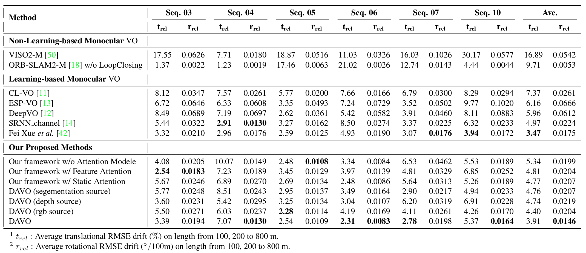

## Experimental Results



We evaluated DAVO and the baselines on the famous KITTI Visual Odometry and SLAM benchmark suite. 
Similar to the baselines, DAVO and its variants are trained on sequences 00, 02, 08, 09, and 
evaluated on sequences 03, 04, 05, 06, 07, 10.  
The performance of the evaluated trajectories for the sequences is measured and reported using a metric called **relative trajectory error (RTE)**, 
which is the benchmark metric adopted in KITTI for measuring the relative translational and rotational errors. 


## Baseline References

### CL-VO

```
@conference{CL-VO,
  title={Learning monocular visual odometry through geometry-aware curriculum learning},
  author={M. R. U. Saputra and P. P. B. de Gusmao and S. Wang and A. Markham and A. Trigoni},
  booktitle={Proc. IEEE Int. Conf. Robotics and Automation (ICRA)},
  month={May},
  year={2019},
  pages={3549-3555}
}
```

### ESP-VO

```
@article{
  title={End-to-end, sequence-to-sequence probabilistic visual odometry through deep neural networks},
  author={S. Wang and R. Clark and H. Wen and A. Trigoni},
  journal={Int. J. Robotics Res.},
  year={2018},
  volume={37},
  pages={513-542}
}
```
  
### DeepVO
```
@conference{
  title={{DeepVO}: Towards end-to-end visual odometry with deep recurrent convolutional neural networks},
  author={S. Wang and R. Clark and H. Wen and A. Trigoni},
  booktitle={Proc. IEEE Int. Conf. Robotics and Automation (ICRA)},
  year={2017},
  month={May},
  pages={2043-2050}
}
```
  
### SRNN_channel
```
@article{
  title={Guided feature selection for deep visual odometry},
  author={F. Xue and Q. Wang and X. Wang and W. Dong and J. Wang and H. Zha},
  journal={Proc. Asian Conf. Computer Vision (ACCV)},
  year={2018},
  month={Dec.}
}
```

### Fei Xue *et al.*
```
@conference{
  title={Beyond tracking: Selecting memory and refining poses for deep visual odometry},
  author={F. Xue and X. Wang,d S. Li and Q. Wang and J. Wang and H. Zha},
  booktitle={Proc. IEEE Conf. Computer Vision and Pattern Recognition (CVPR)},
  year={2019},
  month={Jun.}
}
```
